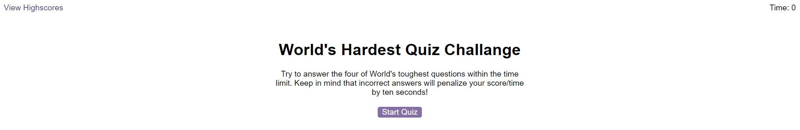

# Quiz
This is simple Quiz in Javascrit enviroment

# Description
This simple quiz is made as part of my practice of Javascript.

# Visuals

# Usage
1. Please hit "Start" button to start the Quiz
2. Once you start in right top corner you will see timer
    2a. Timer is set to 120 sec. and is counting down
    2b. Run out of time means end of the game
3. In the center you will see question with four possible answers
4. Only one answer is correct
5. Select your answer by hitting related button
6. Correct answer adds time to your counter
7. Wrong answer reduce time in your counter
8. Quiz ends if you answer all questions or run out of time
9. Your score is equal to remaining time at the end of game
10. Good luck!

# Licence
MIT